This is a **[PyTorch](https://pytorch.org) Tutorial to Image Captioning**.

This is the first in [a series of tutorials](https://github.com/sgrvinod/Deep-Tutorials-for-PyTorch) I'm writing about _implementing_ cool models on your own with the amazing PyTorch library.

Basic knowledge of PyTorch, convolutional and recurrent neural networks is assumed.

If you're new to PyTorch, first read [Deep Learning with PyTorch: A 60 Minute Blitz](https://pytorch.org/tutorials/beginner/deep_learning_60min_blitz.html) and [Learning PyTorch with Examples](https://pytorch.org/tutorials/beginner/pytorch_with_examples.html).

Questions, suggestions, or corrections can be posted as issues.

I'm using `PyTorch 0.4` in `Python 3.6`.

---

**27 Jan 2020**: Working code for two new tutorials has been added — [Super-Resolution](https://github.com/sgrvinod/a-PyTorch-Tutorial-to-Super-Resolution) and [Machine Translation](https://github.com/sgrvinod/a-PyTorch-Tutorial-to-Machine-Translation)

---

# Contents

[***Objective***](https://github.com/sgrvinod/a-PyTorch-Tutorial-to-Image-Captioning#objective)

[***Concepts***](https://github.com/sgrvinod/a-PyTorch-Tutorial-to-Image-Captioning#concepts)

[***Overview***](https://github.com/sgrvinod/a-PyTorch-Tutorial-to-Image-Captioning#overview)

[***Implementation***](https://github.com/sgrvinod/a-PyTorch-Tutorial-to-Image-Captioning#implementation)

[***Training***](https://github.com/sgrvinod/a-PyTorch-Tutorial-to-Image-Captioning#training)

[***Inference***](https://github.com/sgrvinod/a-PyTorch-Tutorial-to-Image-Captioning#inference)

[***Frequently Asked Questions***](https://github.com/sgrvinod/a-PyTorch-Tutorial-to-Image-Captioning#faqs)

# Objective

**To build a model that can generate a descriptive caption for an image we provide it.**

In the interest of keeping things simple, let's implement the [_Show, Attend, and Tell_](https://arxiv.org/abs/1502.03044) paper. This is by no means the current state-of-the-art, but is still pretty darn amazing. The authors' original implementation can be found [here](https://github.com/kelvinxu/arctic-captions).

This model learns _where_ to look.

As you generate a caption, word by word, you can see the model's gaze shifting across the image.

This is possible because of its _Attention_ mechanism, which allows it to focus on the part of the image most relevant to the word it is going to utter next.

Here are some captions generated on _test_ images not seen during training or validation:

---

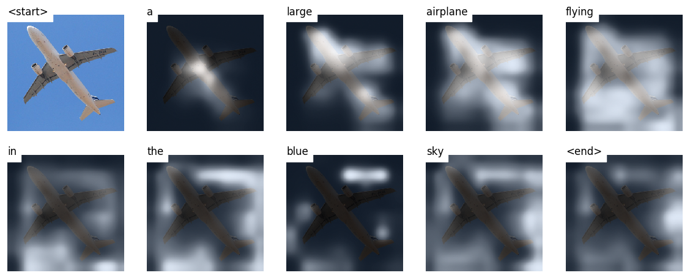

---

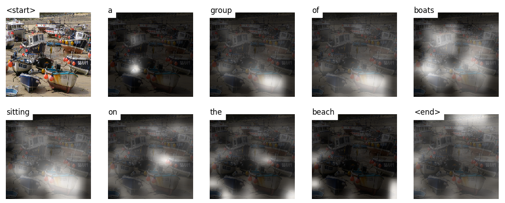

---

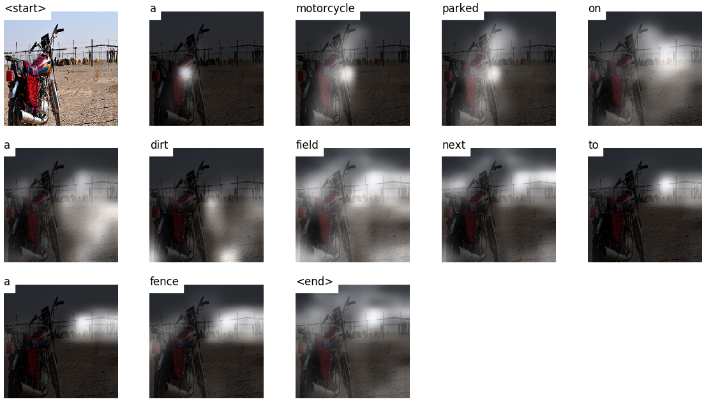

---

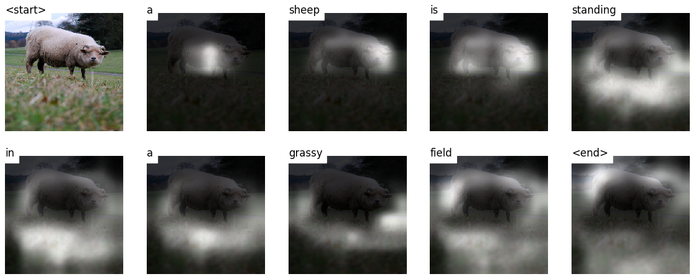

---

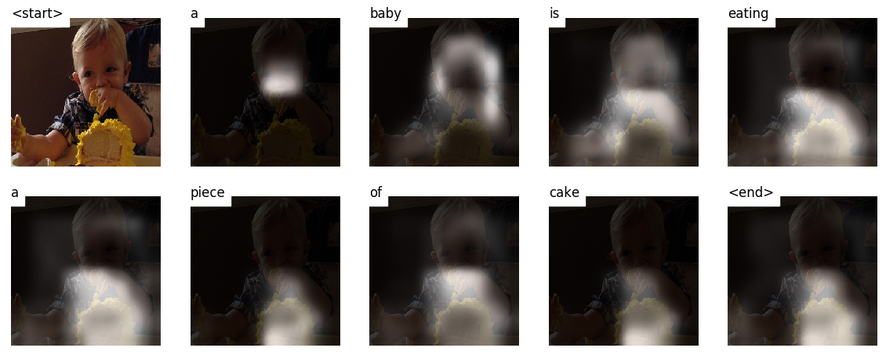

---

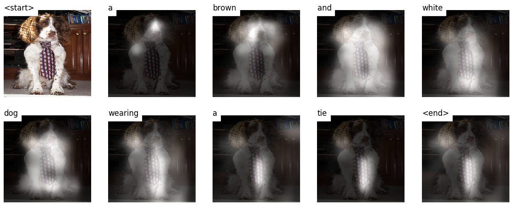

---

There are more examples at the [end of the tutorial](https://github.com/sgrvinod/a-PyTorch-Tutorial-to-Image-Captioning#some-more-examples).

---

# Concepts

* **Image captioning**. duh.

* **Encoder-Decoder architecture**. Typically, a model that generates sequences will use an Encoder to encode the input into a fixed form and a Decoder to decode it, word by word, into a sequence.

* **Attention**. The use of Attention networks is widespread in deep learning, and with good reason. This is a way for a model to choose only those parts of the encoding that it thinks is relevant to the task at hand. The same mechanism you see employed here can be used in any model where the Encoder's output has multiple points in space or time. In image captioning, you consider some pixels more important than others. In sequence to sequence tasks like machine translation, you consider some words more important than others.

* **Transfer Learning**. This is when you borrow from an existing model by using parts of it in a new model. This is almost always better than training a new model from scratch (i.e., knowing nothing). As you will see, you can always fine-tune this second-hand knowledge to the specific task at hand. Using pretrained word embeddings is a dumb but valid example. For our image captioning problem, we will use a pretrained Encoder, and then fine-tune it as needed.

* **Beam Search**. This is where you don't let your Decoder be lazy and simply choose the words with the _best_ score at each decode-step. Beam Search is useful for any language modeling problem because it finds the most optimal sequence.

# Overview

In this section, I will present an overview of this model. If you're already familiar with it, you can skip straight to the [Implementation](https://github.com/sgrvinod/a-PyTorch-Tutorial-to-Image-Captioning#implementation) section or the commented code.

### Encoder

The Encoder **encodes the input image with 3 color channels into a smaller image with "learned" channels**.

This smaller encoded image is a summary representation of all that's useful in the original image.

Since we want to encode images, we use Convolutional Neural Networks (CNNs).

We don't need to train an encoder from scratch. Why? Because there are already CNNs trained to represent images.

For years, people have been building models that are extraordinarily good at classifying an image into one of a thousand categories. It stands to reason that these models capture the essence of an image very well.

I have chosen to use the **101 layered Residual Network trained on the ImageNet classification task**, already available in PyTorch. As stated earlier, this is an example of Transfer Learning. You have the option of fine-tuning it to improve performance.

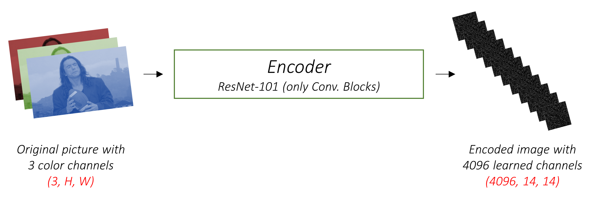

These models progressively create smaller and smaller representations of the original image, and each subsequent representation is more "learned", with a greater number of channels. The final encoding produced by our ResNet-101 encoder has a size of 14x14 with 2048 channels, i.e., a `2048, 14, 14` size tensor.

I encourage you to experiment with other pre-trained architectures. The paper uses a VGGnet, also pretrained on ImageNet, but without fine-tuning. Either way, modifications are necessary. Since the last layer or two of these models are linear layers coupled with softmax activation for classification, we strip them away.

### Decoder

The Decoder's job is to **look at the encoded image and generate a caption word by word**.

Since it's generating a sequence, it would need to be a Recurrent Neural Network (RNN). We will use an LSTM.

In a typical setting without Attention, you could simply average the encoded image across all pixels. You could then feed this, with or without a linear transformation, into the Decoder as its first hidden state and generate the caption. Each predicted word is used to generate the next word.

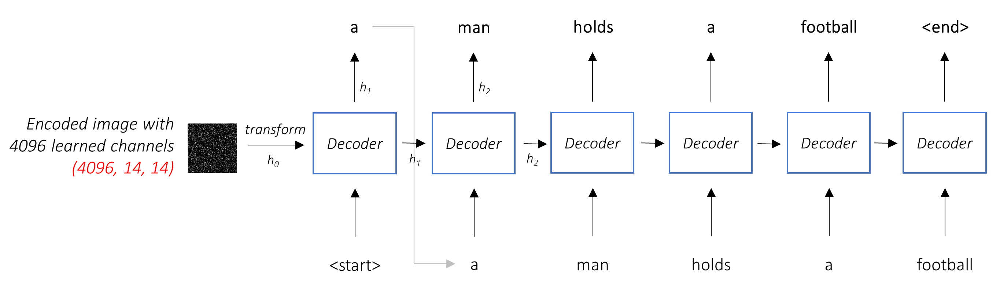

In a setting _with_ Attention, we want the Decoder to be able to **look at different parts of the image at different points in the sequence**. For example, while generating the word `football` in `a man holds a football`, the Decoder would know to focus on – you guessed it – the football!

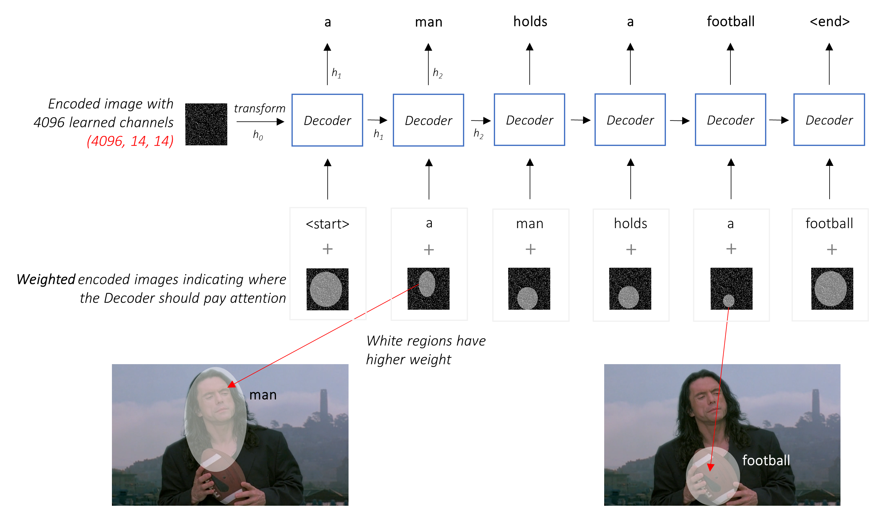

Instead of the simple average, we use the _weighted_ average across all pixels, with the weights of the important pixels being greater. This weighted representation of the image can be concatenated with the previously generated word at each step to generate the next word.

### Attention

The Attention network **computes these weights**.

Intuitively, how would you estimate the importance of a certain part of an image? You would need to be aware of the sequence you have generated _so far_, so you can look at the image and decide what needs describing next. For example, after you mention `a man`, it is logical to declare that he is `holding a football`.

This is exactly what the Attention mechanism does – it considers the sequence generated thus far, and _attends_ to the part of the image that needs describing next.

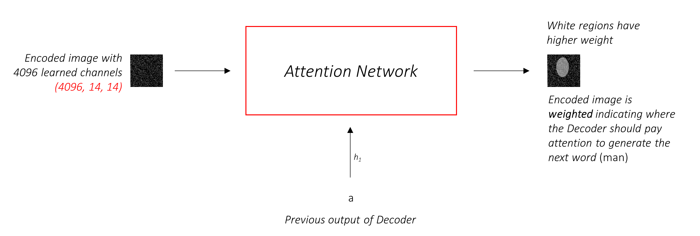

We will use _soft_ Attention, where the weights of the pixels add up to 1. If there are `P` pixels in our encoded image, then at each timestep `t` –

<p align="center">
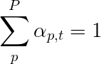
</p>

You could interpret this entire process as computing the **probability that a pixel is _the_ place to look to generate the next word**.

### Putting it all together

It might be clear by now what our combined network looks like.

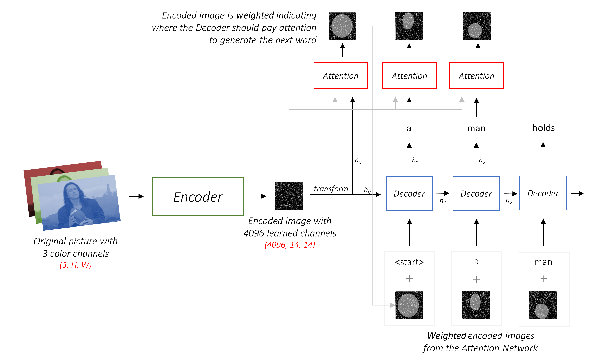

- Once the Encoder generates the encoded image, we transform the encoding to create the initial hidden state `h` (and cell state `C`) for the LSTM Decoder.
- At each decode step,
  - the encoded image and the previous hidden state is used to generate weights for each pixel in the Attention network.
  - the previously generated word and the weighted average of the encoding are fed to the LSTM Decoder to generate the next word.

### Beam Search

We use a linear layer to transform the Decoder's output into a score for each word in the vocabulary.

The straightforward – and greedy – option would be to choose the word with the highest score and use it to predict the next word. But this is not optimal because the rest of the sequence hinges on that first word you choose. If that choice isn't the best, everything that follows is sub-optimal. And it's not just the first word – each word in the sequence has consequences for the ones that succeed it.

It might very well happen that if you'd chosen the _third_ best word at that first step, and the _second_ best word at the second step, and so on... _that_ would be the best sequence you could generate.

It would be best if we could somehow _not_ decide until we've finished decoding completely, and **choose the sequence that has the highest _overall_ score from a basket of candidate sequences**.

Beam Search does exactly this.

- At the first decode step, consider the top `k` candidates.
- Generate `k` second words for each of these `k` first words.
- Choose the top `k` [first word, second word] combinations considering additive scores.
- For each of these `k` second words, choose `k` third words, choose the top `k` [first word, second word, third word] combinations.
- Repeat at each decode step.
- After `k` sequences terminate, choose the sequence with the best overall score.

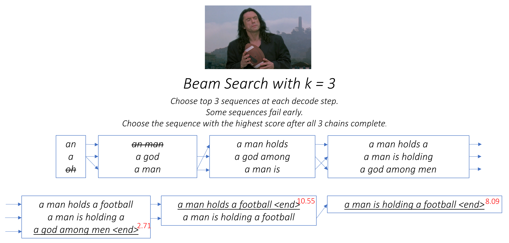

As you can see, some sequences (striked out) may fail early, as they don't make it to the top `k` at the next step. Once `k` sequences (underlined) generate the `<end>` token, we choose the one with the highest score.

# Implementation

The sections below briefly describe the implementation.

They are meant to provide some context, but **details are best understood directly from the code**, which is quite heavily commented.

### Dataset

I'm using the MSCOCO '14 Dataset. You'd need to download the [Training (13GB)](http://images.cocodataset.org/zips/train2014.zip) and [Validation (6GB)](http://images.cocodataset.org/zips/val2014.zip) images.

We will use [Andrej Karpathy's training, validation, and test splits](http://cs.stanford.edu/people/karpathy/deepimagesent/caption_datasets.zip). This zip file contain the captions. You will also find splits and captions for the Flicker8k and Flicker30k datasets, so feel free to use these instead of MSCOCO if the latter is too large for your computer.

### Inputs to model

We will need three inputs.

#### Images

Since we're using a pretrained Encoder, we would need to process the images into the form this pretrained Encoder is accustomed to.

Pretrained ImageNet models available as part of PyTorch's `torchvision` module. [This page](https://pytorch.org/docs/master/torchvision/models.html) details the preprocessing or transformation we need to perform – pixel values must be in the range [0,1] and we must then normalize the image by the mean and standard deviation of the ImageNet images' RGB channels.

```python
mean = [0.485, 0.456, 0.406]
std = [0.229, 0.224, 0.225]
```
Also, PyTorch follows the NCHW convention, which means the channels dimension (C) must precede the size dimensions.

We will resize all MSCOCO images to 256x256 for uniformity.

Therefore, **images fed to the model must be a `Float` tensor of dimension `N, 3, 256, 256`**, and must be normalized by the aforesaid mean and standard deviation. `N` is the batch size.

#### Captions

Captions are both the target and the inputs of the Decoder as each word is used to generate the next word.

To generate the first word, however, we need a *zeroth* word, `<start>`.

At the last word, we should predict `<end>` the Decoder must learn to predict the end of a caption. This is necessary because we need to know when to stop decoding during inference.

`<start> a man holds a football <end>`

Since we pass the captions around as fixed size Tensors, we need to pad captions (which are naturally of varying length) to the same length with `<pad>` tokens.

`<start> a man holds a football <end> <pad> <pad> <pad>....`

Furthermore, we create a `word_map` which is an index mapping for each word in the corpus, including the `<start>`,`<end>`, and `<pad>` tokens. PyTorch, like other libraries, needs words encoded as indices to look up embeddings for them or to identify their place in the predicted word scores.

`9876 1 5 120 1 5406 9877 9878 9878 9878....`

Therefore, **captions fed to the model must be an `Int` tensor of dimension `N, L`** where `L` is the padded length.

#### Caption Lengths

Since the captions are padded, we would need to keep track of the lengths of each caption. This is the actual length + 2 (for the `<start>` and `<end>` tokens).

Caption lengths are also important because you can build dynamic graphs with PyTorch. We only process a sequence upto its length and don't waste compute on the `<pad>`s.

Therefore, **caption lengths fed to the model must be an `Int` tensor of dimension `N`**.

### Data pipeline

See `create_input_files()` in [`utils.py`](https://github.com/sgrvinod/a-PyTorch-Tutorial-to-Image-Captioning/blob/master/utils.py).

This reads the data downloaded and saves the following files –

- An **HDF5 file containing images for each split in an `I, 3, 256, 256` tensor**, where `I` is the number of images in the split. Pixel values are still in the range [0, 255], and are stored as unsigned 8-bit `Int`s.
- A **JSON file for each split with a list of `N_c` * `I` encoded captions**, where `N_c` is the number of captions sampled per image. These captions are in the same order as the images in the HDF5 file. Therefore, the `i`th caption will correspond to the `i // N_c`th image.
- A **JSON file for each split with a list of `N_c` * `I` caption lengths**. The `i`th value is the length of the `i`th caption, which corresponds to the `i // N_c`th image.
- A **JSON file which contains the `word_map`**, the word-to-index dictionary.

Before we save these files, we have the option to only use captions that are shorter than a threshold, and to bin less frequent words into an `<unk>` token.

We use HDF5 files for the images because we will read them directly from disk during training / validation. They're simply too large to fit into RAM all at once. But we do load all captions and their lengths into memory.

See `CaptionDataset` in [`datasets.py`](https://github.com/sgrvinod/a-PyTorch-Tutorial-to-Image-Captioning/blob/master/datasets.py).

This is a subclass of PyTorch [`Dataset`](https://pytorch.org/docs/master/data.html#torch.utils.data.Dataset). It needs a `__len__` method defined, which returns the size of the dataset, and a `__getitem__` method which returns the `i`th image, caption, and caption length.

We read images from disk, convert pixels to [0,255], and normalize them inside this class.

The `Dataset` will be used by a PyTorch [`DataLoader`](https://pytorch.org/docs/master/data.html#torch.utils.data.DataLoader) in `train.py` to create and feed batches of data to the model for training or validation.

### Encoder

See `Encoder` in [`models.py`](https://github.com/sgrvinod/a-PyTorch-Tutorial-to-Image-Captioning/blob/master/models.py).

We use a pretrained ResNet-101 already available in PyTorch's `torchvision` module. Discard the last two layers (pooling and linear layers), since we only need to encode the image, and not classify it.

We do add an `AdaptiveAvgPool2d()` layer to **resize the encoding to a fixed size**. This makes it possible to feed images of variable size to the Encoder. (We did, however, resize our input images to `256, 256` because we had to store them together as a single tensor.)

Since we may want to fine-tune the Encoder, we add a `fine_tune()` method which enables or disables the calculation of gradients for the Encoder's parameters. We **only fine-tune convolutional blocks 2 through 4 in the ResNet**, because the first convolutional block would have usually learned something very fundamental to image processing, such as detecting lines, edges, curves, etc. We don't mess with the foundations.

### Attention

See `Attention` in [`models.py`](https://github.com/sgrvinod/a-PyTorch-Tutorial-to-Image-Captioning/blob/master/models.py).

The Attention network is simple – it's composed of only linear layers and a couple of activations.

Separate linear layers **transform both the encoded image (flattened to `N, 14 * 14, 2048`) and the hidden state (output) from the Decoder to the same dimension**, viz. the Attention size. They are then added and ReLU activated. A third linear layer **transforms this result to a dimension of 1**, whereupon we **apply the softmax to generate the weights** `alpha`.

### Decoder

See `DecoderWithAttention` in [`models.py`](https://github.com/sgrvinod/a-PyTorch-Tutorial-to-Image-Captioning/blob/master/models.py).

The output of the Encoder is received here and flattened to dimensions `N, 14 * 14, 2048`. This is just convenient and prevents having to reshape the tensor multiple times.

We **initialize the hidden and cell state of the LSTM** using the encoded image with the `init_hidden_state()` method, which uses two separate linear layers.

At the very outset, we **sort the `N` images and captions by decreasing caption lengths**. This is so that we can process only _valid_ timesteps, i.e., not process the `<pad>`s.

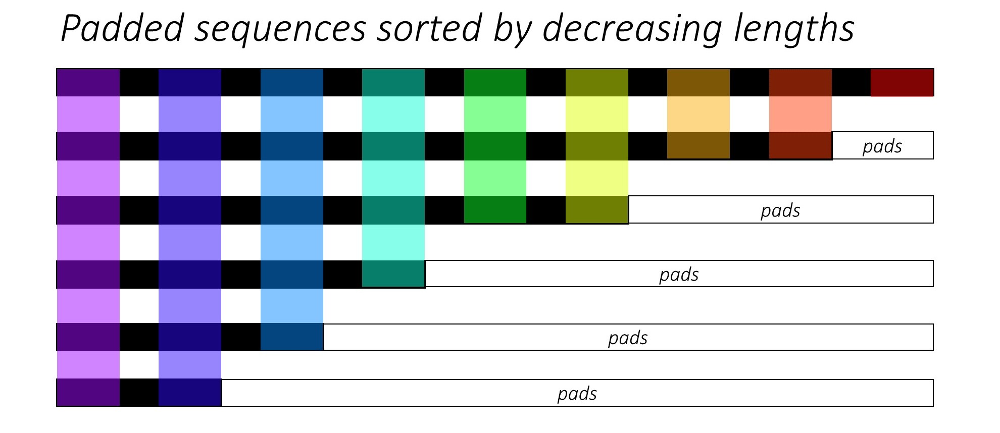

We can iterate over each timestep, processing only the colored regions, which are the **_effective_ batch size** `N_t` at that timestep. The sorting allows the top `N_t` at any timestep to align with the outputs from the previous step. At the third timestep, for example, we process only the top 5 images, using the top 5 outputs from the previous step.

This **iteration is performed _manually_ in a `for` loop** with a PyTorch [`LSTMCell`](https://pytorch.org/docs/master/nn.html#torch.nn.LSTM) instead of iterating automatically without a loop with a PyTorch [`LSTM`](https://pytorch.org/docs/master/nn.html#torch.nn.LSTM). This is because we need to execute the Attention mechanism between each decode step. An `LSTMCell` is a single timestep operation, whereas an `LSTM` would iterate over multiple timesteps continously and provide all outputs at once.

We **compute the weights and attention-weighted encoding** at each timestep with the Attention network. In section `4.2.1` of the paper, they recommend **passing the attention-weighted encoding through a filter or gate**. This gate is a sigmoid activated linear transform of the Decoder's previous hidden state. The authors state that this helps the Attention network put more emphasis on the objects in the image.

We **concatenate this filtered attention-weighted encoding with the embedding of the previous word** (`<start>` to begin), and run the `LSTMCell` to **generate the new hidden state (or output)**. A linear layer **transforms this new hidden state into scores for each word in the vocabulary**, which is stored.

We also store the weights returned by the Attention network at each timestep. You will see why soon enough.

# Training

Before you begin, make sure to save the required data files for training, validation, and testing. To do this, run the contents of [`create_input_files.py`](https://github.com/sgrvinod/a-PyTorch-Tutorial-to-Image-Captioning/blob/master/create_input_files.py) after pointing it to the the Karpathy JSON file and the image folder containing the extracted `train2014` and `val2014` folders from your [downloaded data](https://github.com/sgrvinod/a-PyTorch-Tutorial-to-Image-Captioning#dataset).

See [`train.py`](https://github.com/sgrvinod/a-PyTorch-Tutorial-to-Image-Captioning/blob/master/train.py).

The parameters for the model (and training it) are at the beginning of the file, so you can easily check or modify them should you wish to.

To **train your model from scratch**, simply run this file –

`python train.py`

To **resume training at a checkpoint**, point to the corresponding file with the `checkpoint` parameter at the beginning of the code.

Note that we perform validation at the end of every training epoch.

### Loss Function

Since we're generating a sequence of words, we use **[`CrossEntropyLoss`](https://pytorch.org/docs/master/nn.html#torch.nn.CrossEntropyLoss)**. You only need to submit the raw scores from the final layer in the Decoder, and the loss function will perform the softmax and log operations.

The authors of the paper recommend using a second loss – a "**doubly stochastic regularization**". We know the weights sum to 1 at a given timestep. But we also encourage the weights at a single pixel `p` to sum to 1 across _all_ timesteps `T` –

<p align="center">
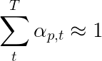
</p>

This means we want the model to attend to every pixel over the course of generating the entire sequence. Therefore, we try to **minimize the difference between 1 and the sum of a pixel's weights across all timesteps**.

**We do not compute losses over the padded regions**. An easy way to do get rid of the pads is to use PyTorch's [`pack_padded_sequence()`](https://pytorch.org/docs/master/nn.html#torch.nn.utils.rnn.pack_padded_sequence), which flattens the tensor by timestep while ignoring the padded regions. You can now aggregate the loss over this flattened tensor.

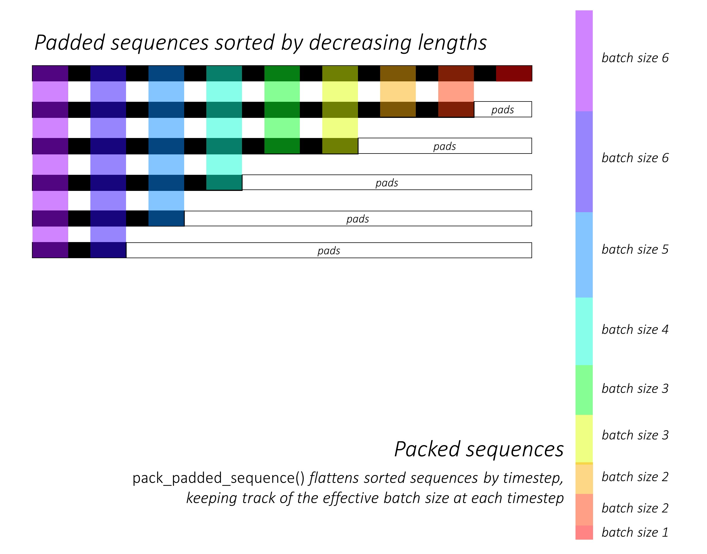

**Note** – This function is actually used to perform the same dynamic batching (i.e., processing only the effective batch size at each timestep) we performed in our Decoder, when using an `RNN` or `LSTM` in PyTorch. In this case, PyTorch handles the dynamic variable-length graphs internally. You can see an example in [`dynamic_rnn.py`](https://github.com/sgrvinod/a-PyTorch-Tutorial-to-Sequence-Labeling/blob/master/dynamic_rnn.py) in my other tutorial on sequence labeling. We would have used this function along with an `LSTM` in our Decoder if we weren't manually iterating because of the Attention network.

### Early stopping with BLEU

To evaluate the model's performance on the validation set, we will use the automated [BiLingual Evaluation Understudy (BLEU)](http://www.aclweb.org/anthology/P02-1040.pdf) evaluation metric. This evaluates a generated caption against reference caption(s). For each generated caption, we will use all `N_c` captions available for that image as the reference captions.

The authors of the _Show, Attend and Tell_ paper observe that correlation between the loss and the BLEU score breaks down after a point, so they recommend to stop training early on when the BLEU score begins to degrade, even if the loss continues to decrease.

I used the BLEU tool [available in the NLTK module](https://www.nltk.org/_modules/nltk/translate/bleu_score.html).

Note that there is considerable criticism of the BLEU score because it doesn't always correlate well with human judgment. The authors also report the METEOR scores for this reason, but I haven't implemented this metric.

### Remarks

I recommend you train in stages.

I first trained only the Decoder, i.e. without fine-tuning the Encoder, with a batch size of `80`.
I trained for 20 epochs, and the BLEU-4 score peaked at about `23.25` at the 13th epoch. I used the [`Adam()`](https://pytorch.org/docs/master/optim.html#torch.optim.Adam) optimizer with an initial learning rate of `4e-4`.

I continued from the 13th epoch checkpoint allowing fine-tuning of the Encoder with a batch size of `32`. The smaller batch size is because the model is now larger because it contains the Encoder's gradients. With fine-tuning, the score rose to `24.29` in just about 3 epochs. Continuing training would probably have pushed the score slightly higher but I had to commit my GPU elsewhere.

An important distinction to make here is that I'm still supplying the ground-truth as the input at each decode-step during validation, _regardless of the word last generated_. This is called __Teacher Forcing__. While this is commonly used during training to speed-up the process, as we are doing, conditions during validation must mimic real inference conditions as much as possible. I haven't implemented batched inference yet – where each word in the caption is generated from the previously generated word, and terminates upon hitting the `<end>` token.

Since I'm teacher-forcing during validation, the BLEU score measured above on the resulting captions _does not_ reflect real performance. In fact, the BLEU score is a metric designed for comparing naturally generated captions to ground-truth captions of differing length. Once batched inference is implemented, i.e. no Teacher Forcing, early-stopping with the BLEU score will be truly 'proper'.

With this in mind, I used [`eval.py`](https://github.com/sgrvinod/a-PyTorch-Tutorial-to-Image-Captioning/blob/master/eval.py) to compute the correct BLEU-4 scores of this model checkpoint on the validation and test sets _without_ Teacher Forcing, at different beam sizes –

Beam Size | Validation BLEU-4 | Test BLEU-4 |
:---: | :---: | :---: |
1 | 29.98 | 30.28 |
3 | 32.95 | 33.06 |
5 | 33.17 | 33.29 |

The test score is higher than the result in the paper, and could be because of how our BLEU calculators are parameterized, the fact that I used a ResNet encoder, and actually fine-tuned the encoder – even if just a little.

Also, remember – when fine-tuning during Transfer Learning, it's always better to use a learning rate considerably smaller than what was originally used to train the borrowed model. This is because the model is already quite optimized, and we don't want to change anything too quickly. I used `Adam()` for the Encoder as well, but with a learning rate of `1e-4`, which is a tenth of the default value for this optimizer.

On a Titan X (Pascal), it took 55 minutes per epoch without fine-tuning, and 2.5 hours with fine-tuning at the stated batch sizes.

### Model Checkpoint

You can download this pretrained model and the corresponding `word_map` [here](https://drive.google.com/open?id=189VY65I_n4RTpQnmLGj7IzVnOF6dmePC).

Note that this checkpoint should be [loaded directly with PyTorch](https://pytorch.org/docs/stable/torch.html?#torch.load), or passed to [`caption.py`](https://github.com/sgrvinod/a-PyTorch-Tutorial-to-Image-Captioning/blob/master/caption.py) – see below.

# Inference

See [`caption.py`](https://github.com/sgrvinod/a-PyTorch-Tutorial-to-Image-Captioning/blob/master/caption.py).

During inference, we _cannot_ directly use the `forward()` method in the Decoder because it uses Teacher Forcing. Rather, we would actually need to **feed the previously generated word to the LSTM at each timestep**.

`caption_image_beam_search()` reads an image, encodes it, and applies the layers in the Decoder in the correct order, while using the previously generated word as the input to the LSTM at each timestep. It also incorporates Beam Search.

`visualize_att()` can be used to visualize the generated caption along with the weights at each timestep as seen in the examples.

To **caption an image** from the command line, point to the image, model checkpoint, word map (and optionally, the beam size) as follows –

`python caption.py --img='path/to/image.jpeg' --model='path/to/BEST_checkpoint_coco_5_cap_per_img_5_min_word_freq.pth.tar' --word_map='path/to/WORDMAP_coco_5_cap_per_img_5_min_word_freq.json' --beam_size=5`

Alternatively, use the functions in the file as needed.

Also see [`eval.py`](https://github.com/sgrvinod/a-PyTorch-Tutorial-to-Image-Captioning/blob/master/eval.py), which implements this process for calculating the BLEU score on the validation set, with or without Beam Search.

### Some more examples

---

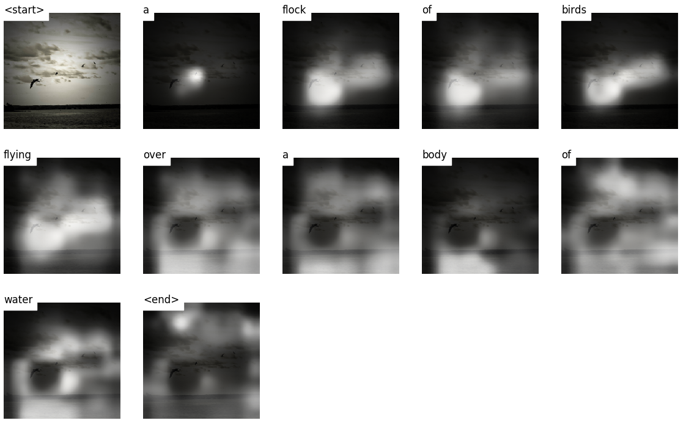

---

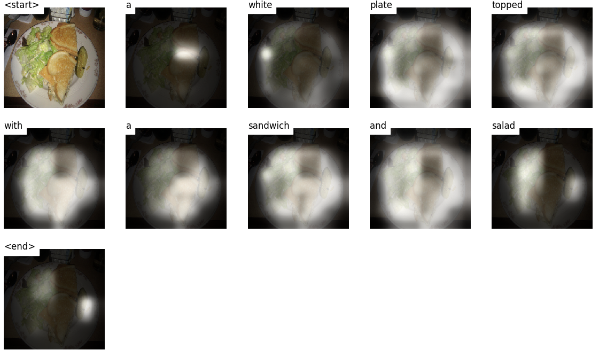

---

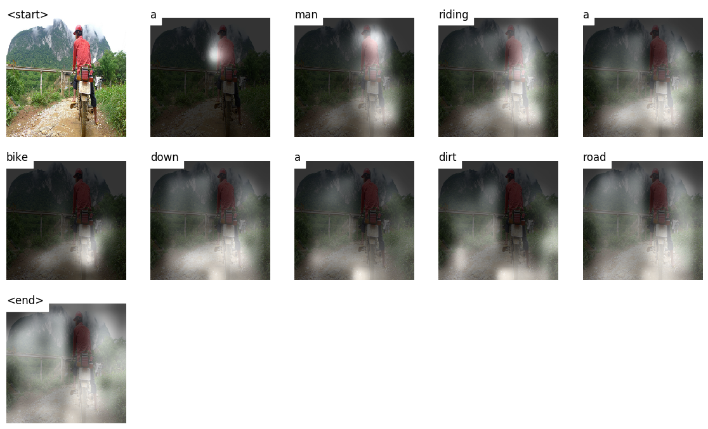

---

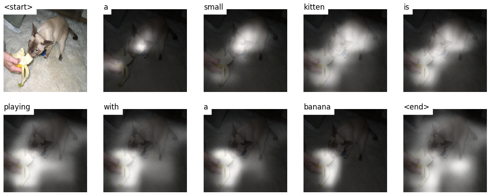

---

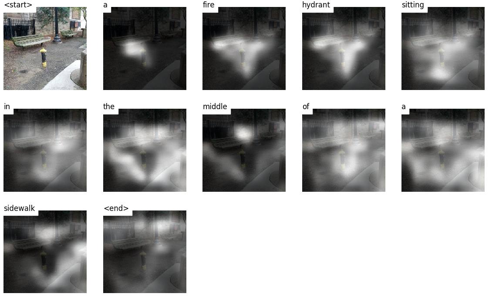

---

**The ~~Turing~~ Tommy Test** – you know AI's not really AI because it hasn't watched _The Room_ and doesn't recognize greatness when it sees it.

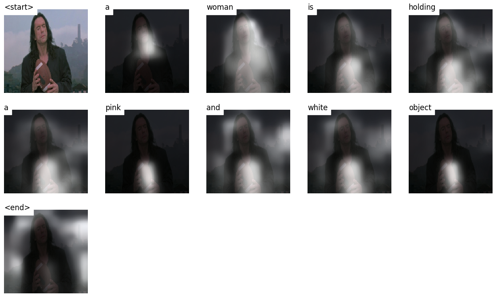

---

# FAQs

__You said__ ___soft___ __attention. Is there, um, a__ ___hard___ __attention?__

Yes, the _Show, Attend and Tell_ paper uses both variants, and the Decoder with "hard" attention performs marginally better.

In _soft_ attention, which we use here, you're computing the weights `alpha` and using the weighted average of the features across all pixels. This is a deterministic, differentiable operation.

In _hard_ attention, you are choosing to just sample some pixels from a distribution defined by `alpha`. Note that any such probabilistic sampling is non-deterministic or _stochastic_, i.e. a specific input will not always produce the same output. But since gradient descent presupposes that the network is deterministic (and therefore differentiable), the sampling is reworked to remove its stochasticity. My knowledge of this is fairly superficial at this point – I will update this answer when I have a more detailed understanding.

---

__How do I use an attention network for an NLP task like a sequence to sequence model?__

Much like you use a CNN to generate an encoding with features at each pixel, you would use an RNN to generate encoded features at each timestep i.e. word position in the input.

Without attention, you would use the Encoder's output at the last timestep as the encoding for the entire sentence, since it would also contain information from prior timesteps. The Encoder's last output now bears the burden of having to encode the entire sentence meaningfully, which is not easy, especially for longer sentences.

With attention, you would attend over the timesteps in the Encoder's output, generating weights for each timestep/word, and take the weighted average to represent the sentence. In a sequence to sequence task like machine translation, you would attend to the relevant words in the input as you generate each word in the output.

You could also use Attention without a Decoder. For example, if you want to classify text, you can attend to the important words in the input just once to perform the classification.

---

__Can we use Beam Search during training?__

Not with the current loss function, but [yes](https://arxiv.org/abs/1606.02960). This is not common at all.

---

__What is Teacher Forcing?__

Teacher Forcing is when we use the ground truth captions as the input to the Decoder at each timestep, and not the word it generated in the previous timestep. It's common to teacher-force during training since it could mean faster convergence of the model. But it can also learn to depend on being told the correct answer, and exhibit some instability in practice.

It would be ideal to train using Teacher Forcing [only some of the time](https://pytorch.org/tutorials/intermediate/seq2seq_translation_tutorial.html#training-the-model), based on a probability. This is called Scheduled Sampling.

(I plan to add the option).

---

__Can I use pretrained word embeddings (GloVe, CBOW, skipgram, etc.) instead of learning them from scratch?__

Yes, you could, with the `load_pretrained_embeddings()` method in the `Decoder` class. You could also choose to fine-tune (or not) with the `fine_tune_embeddings()` method.

After creating the Decoder in [`train.py`](https://github.com/sgrvinod/a-PyTorch-Tutorial-to-Image-Captioning/blob/master/train.py), you should provide the pretrained vectors to `load_pretrained_embeddings()` stacked in the same order as in the `word_map`. For words that you don't have pretrained vectors for, like `<start>`, you can initialize embeddings randomly like we did in `init_weights()`. I recommend fine-tuning to learn more meaningful vectors for these randomly initialized vectors.
  
```python
decoder = DecoderWithAttention(attention_dim=attention_dim,
                               embed_dim=emb_dim,
                               decoder_dim=decoder_dim,
                               vocab_size=len(word_map),
                               dropout=dropout)
decoder.load_pretrained_embeddings(pretrained_embeddings)  # pretrained_embeddings should be of dimensions (len(word_map), emb_dim)
decoder.fine_tune_embeddings(True)  # or False
```
  
Also make sure to change the `emb_dim` parameter from its current value of `512` to the size of your pre-trained embeddings. This should automatically adjust the input size of the decoder LSTM to accomodate them.

---

__How do I keep track of which tensors allow gradients to be computed?__

With the release of PyTorch `0.4`, wrapping tensors as `Variable`s is no longer required. Instead, tensors have the `requires_grad` attribute, which decides whether it is tracked by `autograd`, and therefore whether gradients are computed for it during backpropagation.

- By default, when you create a tensor from scratch, `requires_grad` will be set to `False`.
- When a tensor is created from or modified using another tensor that allows gradients, then `requires_grad` will be set to `True`.
- Tensors which are parameters of `torch.nn` layers will already have `requires_grad` set to `True`.

---

__How do I compute all BLEU (i.e. BLEU-1 to BLEU-4) scores during evaluation?__

You'd need to modify the code in [`eval.py`](https://github.com/sgrvinod/a-PyTorch-Tutorial-to-Image-Captioning/blob/master/eval.py) to do this. Please see [this excellent answer](<https://github.com/sgrvinod/a-PyTorch-Tutorial-to-Image-Captioning/issues/37#issuecomment-455924998>) by [kmario23](<https://github.com/kmario23>) for a clear and detailed explanation.
